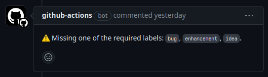

[< index](./index)

# Putting The Rust In GitHub Actions

11-01-2024

GitHub Actions feels like a great idea that is poorly executed. Automating all secondary processes
in software development (code formatting, linting, testing, build, release, etc.) is key to being
able to work productively on large software projects. GitHub Actions solves this problem in the
worst possible way. But since it is baked in GitHub, it is now the de facto standard for workflow
automation.

What GitHub Actions is: Throw config files together to automatically run commands on certain
repository events to automate processes that would otherwise be manual. What it could be: A
metaprogramming environment that allows developers to program workflows to manage their codebases
in the same way they write software.

Unfortunately, YAML files and a clunky UI don't make for a great developer experience. Awaiting a
better solution, we can hide the pain by painting over GitHub Actions with a thick layer of Rust.

The idea is: Make a workflow in Rust with the excellent [`octocrab` crate](https://github.com/XAMPPRocky/octocrab).
Use a minimal GitHub Actions workflow to run it.

For storytelling purposes, let us create a workflow that ensures that all open issues have at
least one of a required set of labels.

I opted to put the Rust project inside the `.github` directory close to where the rest of the CI
stuff lives, in `.github/actions/issue_labels_check`:

```
$ tree -a
.
└── .github
    └── actions
        └── issue_labels_check
            ├── Cargo.toml
            └── src
                └── main.rs
```

We will be using three crates:

* `anyhow` for error handling.
* `octocrab` for interacting with GitHub.
* `tokio` with a minimal feature set for our async executor (required for `octocrab`).

#### `Cargo.toml`

```toml
[package]
name = "issue_labels_check"
version = "0.1.0"
edition = "2021"

[dependencies]
anyhow = "1.0"
octocrab = "0.32"
tokio = { version = "1.0", default_features = false, features = [
    "macros",
    "rt-multi-thread",
] }
```

First, let us create a static list of accepted labels:

```rust
static LABEL_SET: [&str; 3] = ["bug", "enhancement", "idea"];
```

Inside our `main` function we'll load some environment variables that we are going to need to
interact with the GitHub API:

* `GITHUB_TOKEN`: The token we will use to authenticate with GitHub. This will be provided by
  GitHub Actions and we'll assume the github-actions bot identity with it. We must pass it
  manually from the workflow later.
* `GITHUB_REPOSITORY`: This is the repository slug: organization/repo. It is set automatically
  in the GitHub Actions runner context so no need to pass it manually.

Here's the code:

```rust
let github_token = std::env::var("GITHUB_TOKEN").map_err(|_| {
    anyhow!("missing github token: make sure to set the `GITHUB_TOKEN` environment variable",)
})?;
let repository = std::env::var("GITHUB_REPOSITORY")
    .context("environment variable `GITHUB_REPOSITORY` not set")?;
// ...
}
```

There will be two triggers for this GitHub workflow:

* All issues and pull requests will be checked periodically.
* When an issue or pull request is opened it is checked.

The caller of our Rust program can choose to provide a number as argument. If they do, we only
check the corresponding issue. If they don't pass a number, we go through all issues and PRs.

```rust
let issue_number = match std::env::args().nth(1) {
    Some(issue_number) => Some(
        issue_number
            .parse::<u64>()
            .context("invalid issue number")?,
    ),
    None => None,
};
```

Here comes the part where we use `octocrab` to connect to GitHub, and do all the magic:

First, we extract the owner and repository name from the repository slug we pulled from the
environment variable:

```rust
let (owner, repository) = repository
    .split_once('/')
    .ok_or(anyhow!("invalid repository"))?;
```

Second, we initialize `octocrab` with the token and create an issue handler object:

```rust
let octocrab = octocrab::OctocrabBuilder::default()
    .personal_token(github_token)
    .build()
    .context("failed to initialize octocrab")?;
let issue_handler = octocrab.issues(owner, repository);
```

Thrid, depending on whether the caller passed a specific issue:

```rust
if let Some(issue_number) = issue_number {
    let issue = issue_handler.get(issue_number).await?;
    check_issue(&issue, &issue_handler).await?;
} else {
    let issues = octocrab
        .all_pages(
            issue_handler
                .list()
                .state(octocrab::params::State::Open)
                .per_page(100)
                .send()
                .await?,
        )
        .await?;
    for issue in &issues {
        check_issue(issue, &issue_handler).await?;
    }
}
```

Note that we use the `all_pages` function in `octocrab` to take some of the page enumeration
boilerplate code away.

And finally the `check_issue` function:

```rust
async fn check_issue(
    issue: &octocrab::models::issues::Issue,
    issue_handler: &octocrab::issues::IssueHandler<'_>,
) -> Result<()> {
    let mut have_label = false;
    for label in &issue.labels {
        if LABEL_SET.contains(&&*label.name) {
            have_label = true;
        }
    }
    if !have_label {
        issue_handler
            .create_comment(
                issue.number,
                format!(
                    ":warning: Missing one of the required labels: {}.",
                    labels
                        .into_iter()
                        .map(|label| format!("`{label}`"))
                        .collect::<Vec<_>>()
                        .join(", "),
                ),
            )
            .await?;
    }
    Ok(())
}
```

We still need a GitHub Actions workflow to actually run the thing though.

Let's name it: `issue_labels_check.yaml`. The first part:

```yaml
name: issue labels check

env:
  CARGO_TERM_COLOR: always
```

(I guess we want to see those sweet Cargo colors.)

Since our Rust project does not live in the root directory, we have to change the working
directory:

```yaml
defaults:
  run:
    working-directory: .github/actions/issue_labels_check
```

This is how we can configure the workflow to run periodically, as well as when an issue or pull
request is created:

```yaml
on:
  schedule:
    - cron: '0 8 * * 1'  # every Monday at 8am
  issues:
    types: [opened]
  pull_request:
    types: [opened]
```

(Monday 9am is the perfect time to bother people.)

The workflow has a single job: `check`. In it, we pass on the GitHub Actions built-in token to
the environment variable that our Rust program expects. For security reasons, GitHub does not do
this automatically. We also define an environment variable that contains the event name, which
will be either `schedule`, `issues` or `pull_request`. Lastly, we put the issue or event number
in a variable.

I somehow never noticed that issues and pull requests share their IDs. If you create a new
repository and create an issue, then create a pull request, they will have numbers #1 and #2. The
same happens in the API. Listing issues with the GitHub API (`/issues`) returns both issues and
pull requests. Listing pull requests does not return issues. Regardless, the issue opened event in
Actions is **not** triggered when a pull request is opened. You have to use `pull_request.opened`
for that. Moreover, to access the "number", you must use `github.event.pull_request.number` if a
pull request event was triggered, `github.event.issue.number` if it was triggered by an "issues"
event. Guess what API endpoint you have to use to post comments on a pull request? It's
`/issues/comments`...

```yaml
jobs:

  check:
    runs-on: ubuntu-latest

    env:
      GITHUB_TOKEN: ${{ secrets.GITHUB_TOKEN }}
      GITHUB_EVENT:  ${{ github.event_name }}
      GITHUB_EVENT_NUMBER: ${{ github.event.pull_request.number || github.event.issue.number }}
```

The job contains the steps needed to compile and run our Rust action. The last step has some logic
to decide whether or not to pass on the event number, depending on what event triggered the
workflow.

```yaml
    steps:
    - name: Checkout
      uses: actions/checkout@v4

    - name: Setup Rust
      uses: dtolnay/rust-toolchain@v1
      with:
        toolchain: stable

    - name: Cache dependencies
      uses: Swatinem/rust-cache@v2.2.1
      with:
        workspaces: .github/actions/issue_labels_check

    - name: Check issue labels
      run: |
        if [ "${GITHUB_EVENT}" == "schedule" ]; then
          cargo run --release
        elif [ "${GITHUB_EVENT}" == "issues" ]; then
          cargo run --release "${GITHUB_EVENT_NUMBER}"
        elif [ "${GITHUB_EVENT}" == "pull_request" ]; then
          cargo run --release "${GITHUB_EVENT_NUMBER}"
        fi
```

The `rust-cache` step helps to speed up the workflow file. It still takes a bit too long for a
simple action. Especially compared to running a bash file. It would probably be better to compile
the action in a separate workflow, upload the binary as artifact and then download and run it.
That would be a significant speed up.

Anyway, our bot now works and posts comments on unlabeled issues:



I enjoyed this way of writing a GitHub workflow. Especially compared to the bash-based monstrosities
that [GitHub themselves are cooking up](https://docs.github.com/en/actions/using-workflows/using-github-cli-in-workflows):

```yaml
name: Report remaining open issues
on: 
  schedule: 
    # Daily at 8:20 UTC
    - cron: '20 8 * * *'
jobs:
  track_pr:
    runs-on: ubuntu-latest
    steps:
      - run: |
          numOpenIssues="$(gh api graphql -F owner=$OWNER -F name=$REPO -f query='
            query($name: String!, $owner: String!) {
              repository(owner: $owner, name: $name) {
                issues(states:OPEN){
                  totalCount
                }
              }
            }
          ' --jq '.data.repository.issues.totalCount')"

          echo 'NUM_OPEN_ISSUES='$numOpenIssues >> $GITHUB_ENV
        env:
          GH_TOKEN: ${{ secrets.GITHUB_TOKEN }}
          OWNER: ${{ github.repository_owner }}
          REPO: ${{ github.event.repository.name }}
      - run: |
          gh issue create --title "Issue report" --body "$NUM_OPEN_ISSUES issues remaining" --repo $GITHUB_REPOSITORY
        env:
          GH_TOKEN: ${{ secrets.GITHUB_TOKEN }}

```

Please don't do this. Write Rusty workflows instead!

---

## Code

#### `main.rs`

```rust
static LABEL_SET: [&str; 3] = ["bug", "enhancement", "idea"];

#[tokio::main]
async fn main() -> Result<()> {
    let github_token = std::env::var("GITHUB_TOKEN").map_err(|_| {
        anyhow!("missing github token: make sure to set the `GITHUB_TOKEN` environment variable",)
    })?;
    let repository = std::env::var("GITHUB_REPOSITORY")
        .context("environment variable `GITHUB_REPOSITORY` not set")?;

    let issue_number = match std::env::args().nth(1) {
        Some(issue_number) => Some(
            issue_number
                .parse::<u64>()
                .context("invalid issue number")?,
        ),
        None => None,
    };

    let (owner, repository) = repository
        .split_once('/')
        .ok_or(anyhow!("invalid repository"))?;

    let octocrab = octocrab::OctocrabBuilder::default()
        .personal_token(github_token)
        .build()
        .context("failed to initialize octocrab")?;
    let issue_handler = octocrab.issues(owner, repository);

    if let Some(issue_number) = issue_number {
        let issue = issue_handler.get(issue_number).await?;
        check_issue(&issue, &issue_handler).await?;
    } else {
        let issues = octocrab
            .all_pages(
                issue_handler
                    .list()
                    .state(octocrab::params::State::Open)
                    .per_page(100)
                    .send()
                    .await?,
            )
            .await?;
        for issue in &issues {
            check_issue(issue, &issue_handler).await?;
        }
    }
}

async fn check_issue(
    issue: &octocrab::models::issues::Issue,
    issue_handler: &octocrab::issues::IssueHandler<'_>,
) -> Result<()> {
    let mut have_label = false;
    for label in &issue.labels {
        if LABEL_SET.contains(&&*label.name) {
            have_label = true;
        }
    }
    if !have_label {
        issue_handler
            .create_comment(
                issue.number,
                format!(
                    ":warning: Missing one of the required labels: {}.",
                    labels
                        .into_iter()
                        .map(|label| format!("`{label}`"))
                        .collect::<Vec<_>>()
                        .join(", "),
                ),
            )
            .await?;
    }
    Ok(())
}
```

#### `issue_labels_check.yaml`

```yaml
name: issue labels check

env:
  CARGO_TERM_COLOR: always

defaults:
  run:
    working-directory: .github/actions/issue_labels_check

on:
  schedule:
    - cron: '0 8 * * 1'  # every Monday at 8am
  issues:
    types: [opened]
  pull_request:
    types: [opened]

jobs:

  check:
    runs-on: ubuntu-latest

    env:
      GITHUB_TOKEN: ${{ secrets.GITHUB_TOKEN }}
      GITHUB_EVENT:  ${{ github.event_name }}
      GITHUB_EVENT_NUMBER: ${{ github.event.pull_request.number || github.event.issue.number }}

    steps:
    - name: Checkout
      uses: actions/checkout@v4

    - name: Setup Rust
      uses: dtolnay/rust-toolchain@v1
      with:
        toolchain: stable

    - name: Cache dependencies
      uses: Swatinem/rust-cache@v2.2.1
      with:
        workspaces: .github/actions/issue_labels_check

    - name: Check issue labels
      run: |
        if [ "${GITHUB_EVENT}" == "schedule" ]; then
          cargo run --release
        elif [ "${GITHUB_EVENT}" == "issues" ]; then
          cargo run --release "${GITHUB_EVENT_NUMBER}"
        elif [ "${GITHUB_EVENT}" == "pull_request" ]; then
          cargo run --release "${GITHUB_EVENT_NUMBER}"
        fi
```